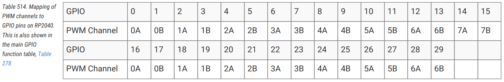
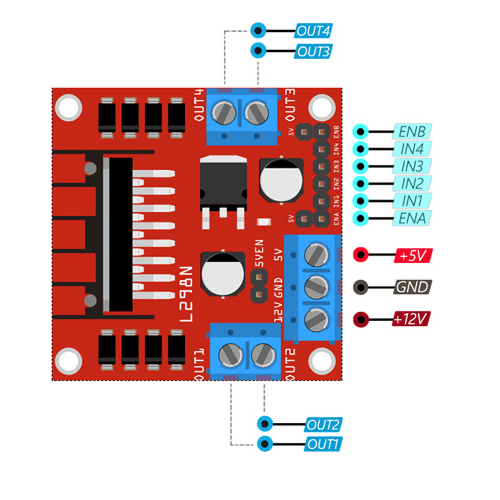
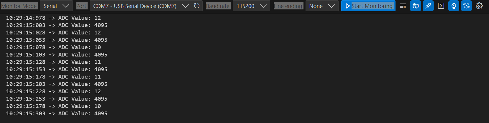

# LAB 4: PWM & ADCs

**OBJECTIVES**
-	Configure and implement Pulse Width Modulation (PWM) on RPi Pico
-	Configure and implement an Analog-to-Digital Converter (ADC) on RPi Pico
-	Understand how to configure the (line following) IR-based sensor & L298N Motor controller


**EQUIPMENT** 
1.	A laptop that has the Pico C/C++ SDK installed
2.	Raspberry Pico W
3.	Micro-USB Cable
4.	IR-based Line Sensor
5.	Motor Controller & DC Motor

> [NOTE]
> Only students wearing fully covered shoes are allowed in the SR6A lab due to safety.

## **INTRODUCTION** 

In the previous lab session, we learned that we can use interrupts to detect and react to requests from the GPIO and Timer. For GPIO, we can react when the GPIO pins change while for the Timer, we can invoke callback functions once the timer has lapsed. A timer can also be used as a counter that keeps track of the number of times a particular event or process occurred regarding a clock signal. It is used to count the events happening outside the microcontroller. However, this counter can also be configured to produce a pulse with a specific duty cycle known as pulse-width modulation (PWM). It is particularly useful for tasks like motor control, LED dimming, and generating analog-like signals. PWM works by varying the duty cycle (percentage of time the signal is ON) of a square wave signal while keeping its frequency constant. 

Typically, GPIO when configured as input is able to accept data as high, low, or edge-based signals. However, the world we live in doesn't always offer discrete data. Thus, we would also be looking at Analog-to-Digital Converter (ADC), which is an essential part of any embedded system. It helps to obtain **Analog** data (i.e. temperature, humidity, etc) that can’t be directly read on any microcontroller as they are in analog format. To read this type of analog data, we have to convert this analog data into a digital format via an ADC inside the microcontroller.

Lastly, we will understand how we can use PWM to adjust the speed of the motor via the motor controller and incorporate ADC for the IR-based sensor in measuring contrast on the surface.

## **PULSE-WIDTH MODULATION** 

The Raspberry Pi Pico, with its GPIO pins and the Pico C SDK, provides a convenient way to generate PWM signals for various applications. Configuring PWM on the Raspberry Pi Pico using the Pico C SDK involves several steps, including initializing the PWM hardware, setting the frequency, configuring channels, and controlling the duty cycle. PWM on the Raspberry Pi Pico is achieved through PWM slices. To understand how PWM works on the Pico, it's essential to understand the concept of PWM slices and how they generate PWM signals.

**What are PWM Slices?**

PWM slices are hardware modules on the Raspberry Pi Pico designed to generate PWM signals. These slices offer a flexible and efficient way to produce PWM waveforms with precise control over parameters like frequency, duty cycle, and polarity. The Pico has multiple PWM slices, and each slice can generate one or more PWM channels.

**Key Features and Concepts:**

The RP2040 PWM block has eight identical slices, where each slice can drive two PWM output signals or measure the frequency or duty cycle of an input signal. This gives a total of up to 16 controllable PWM outputs. All 30 GPIO pins can be driven by the PWM block, as shown below.



**How PWM Slices Work:**

1. **Initialization:** `pwm_init(slice_num, &config, start)` initialises **one slice** — the one you name — from a configuration struct. There is no call that initialises all of them at once; each slice you use, you set up.
2. **Configuring Channels:** You configure the GPIO pins for PWM operation by setting their functions to `GPIO_FUNC_PWM` using `gpio_set_function()`. This allocates the pins to specific PWM channels.
3. **Frequency Setup:** The output frequency is set by **two** values together, not one:

   $$f_{\text{PWM}} = \frac{f_{\text{sys}}}{\text{clkdiv} \times (\text{wrap} + 1)}$$

   `pwm_set_clkdiv()` divides the 125 MHz system clock; `pwm_set_wrap()` sets how far the slice counts before rolling over. Changing either one changes the frequency, and you cannot reach an arbitrary frequency by touching only `wrap`. **Note the `+ 1`: the counter runs from 0 to `wrap` inclusive, so a wrap of 12499 gives 12500 counts, not 12499.** Off-by-one here is a defect you will meet again in Bug Hunt #4.
4. **Duty Cycle:** To control the duty cycle, you use the `pwm_set_chan_level()` function to specify when the signal transitions between high and low within each PWM cycle. The level is compared against the same counter, so **duty = level / (wrap + 1)** — the duty cycle depends on `wrap`, and changing the frequency changes the duty cycle unless you recompute the level.
5. **Enabling PWM:** Once you've configured the PWM slices and channels, you enable the PWM signal using `pwm_set_enabled()`.
6. **Updating Parameters:** If needed, you can update the PWM parameters, such as frequency or duty cycle, at runtime to modify the PWM signal.
7. **Disabling PWM:** When you're done with PWM, disable it using `pwm_set_enabled()`.

The following code [hello_pwm](https://github.com/raspberrypi/pico-examples/blob/master/pwm/hello_pwm/hello_pwm.c) illustrates a simple example of how a PWM can be configured on the Raspberry Pi Pico. You could connect GP0 and GP1 to an oscilloscope to observe the signal. Alternatively, you may observe the effects of PWM on the motor controller by connecting, as described in the next section.

### Key PWM Concepts:
- **PWM (Pulse Width Modulation)**: A technique to control the voltage output by rapidly switching the output between high and low, effectively varying the average voltage over time. It is widely used in motor control, LED brightness control, and other applications where analog-like behavior is desired from digital signals.
- **Duty Cycle**: The percentage of time the signal is in a high (on) state within a single PWM period. For example, a 50% duty cycle means the signal is high for half the time and low for the other half.
- **Frequency**: The number of times the PWM cycle repeats per second. For motor control, a typical PWM frequency might be in the range of 100Hz to a few kHz.


## **UNDERSTANDING THE L298N MOTOR CONTROLLER - hello_pwm example**

The L298N module is a high-power motor driver module for driving DC and stepper motors. This module comprises an L298 motor driver IC and a 78M05 5V regulator. This module can control up to two DC motors with directional and speed control. The module's datasheet can be found at the following [link](https://components101.com/modules/l293n-motor-driver-module). 



HiBit. (2023). *L298N motor driver pinout diagram* Retrieved from [here](https://components101.com/modules/l293n-motor-driver-module) 

https://cdn.hibit.dev/images/posts/2023/schemas/l298n_pinout.png

There are two ways for this module to control the speed of the motor. An easier way would be to use a jumper across ENA and ENB to fix the voltage to the maximum. However, removing the jumper and connecting the pin to a PWM source would facilitate controlling the motor’s speed. PWM is a widely used technique to control the speed of DC motors, including those used in robotics and other applications.


Again, we can use the [hello_pwm](https://github.com/raspberrypi/pico-examples/blob/master/pwm/hello_pwm/hello_pwm.c) code with some changes to demonstrate how PWM can control the motor speed using the L298N motor controller. Connect the motor controller as follows and observe how fast the motor turns.

An alternative image of connecting them can be seen [here](img/motorconnection.jpg).

The following changes are required:
1. change `gpio_set_function(0, GPIO_FUNC_PWM);` --> `gpio_set_function(2, GPIO_FUNC_PWM);`
2. add `pwm_set_clkdiv(slice_num, 100);` before the wrap is set
3. change `pwm_set_wrap(slice_num, 3);` --> `pwm_set_wrap(slice_num, 12500);`
4. change `pwm_set_chan_level(slice_num, PWM_CHAN_A, 1);` --> `pwm_set_chan_level(slice_num, PWM_CHAN_A, 12500/2);`
5. comment out the channel B line: `pwm_set_chan_level(slice_num, PWM_CHAN_B, 3);` --> `//pwm_set_chan_level(slice_num, PWM_CHAN_B, 3);`

> [!NOTE]
> A C comment is `//`, not `\\`. Line numbers in the upstream example move whenever it is updated, so the changes above name the *code* rather than the line.

This modified code snippet configures the Raspberry Pi Pico to generate PWM (Pulse Width Modulation) signals on GP2 via the gpio_set_function function. It then obtains the PWM slice number associated with GP2 and sets the clock divisor to 100, reducing the main clock from 125Mhz to 1.25Mhz frequency. The pwm_set_wrap function sets the PWM wrap value, essentially determining the period of the PWM signal. Here, it's set to 12500, which corresponds to a period of 10ms. This is obtained as follows: ```((1 / 1.25Mhz)*12500) ```. pwm_set_chan_level sets the duty cycle of the PWM signal on channel A of the specified PWM slice to 50% (12500/2). Finally, pwm_set_enabled enables the PWM output on the specified slice. In summary, this code initializes PWM on GP2 with a 100Hz frequency and a 50% duty cycle, effectively generating a square wave output.

The L298N motor controller's N3 and N4 pins control the motor's turning direction. In this example, we connect N3 to GP0 and N4 to GP1. By setting GP0 and GP1 to different combinations of High and Low, the motor can be controlled to rotate clockwise, counterclockwise, or stop. For example:

- Setting GP0 High and GP1 Low will rotate the motor clockwise.
- Setting GP0 Low and GP1 High will rotate the motor counterclockwise.
- Setting both GP0 and GP1 either High or Low will stop the motor.

## **UNDERSTANDING THE L298N MOTOR CONTROLLER - pwm_set_gpio_level example**

The alternative C [code](l298n.c) configures the Pico to use Pulse Width Modulation on GP2 and control motor direction using an L298N motor driver via GP0 and GP1.

> [!IMPORTANT]
> **This code is a worked example, not reference code to copy.**
>
> It compiles. It runs. The motor turns, and turns at what looks like the right
> speed. **Two things inside `setup_pwm()` are wrong, and both are arithmetic** —
> the same two classes of defect Bug Hunt #4 is built around. Code in exactly
> this state has been shipped by more than one person, which is the point of
> showing it to you.
>
> Find them by **measuring**, not by staring:
>
> 1. Ask for **100 Hz**. Put a scope on GP2 and measure the actual frequency.
>    Write down both numbers before you look for a cause.
> 2. Ask for **100% duty** — change the call to `setup_pwm(PWM_PIN, 100.0f, 1.0f)`.
>    Measure the pin. What did you get, and is it anywhere near what you asked
>    for?
> 3. Ask for **5 Hz**. Work out what `divider` holds, then check it against the
>    hardware limit for the clock divider in the RP2040 datasheet.
>
> Then explain each one in a sentence beginning *"the type is…"*, and only then
> fix them. A fix you cannot explain is not a fix — see
> [BUGHUNT.md](../BUGHUNT.md), rule 4.

The breakdown below describes what each line is **intended** to do. Read it
against the code rather than as a description of the code, because in two
places the intention and the behaviour are not the same thing.

### Key PWM-related Code Snippets Explained:

1. **`setup_pwm` Function:**
   This function is the heart of the PWM configuration, setting the frequency and duty cycle for a specified GPIO pin.
   
   - **Set the GPIO function to PWM:**
     ```c
     gpio_set_function(gpio, GPIO_FUNC_PWM);
     ```
     This configures the specified GPIO pin (e.g., `PWM_PIN`) to function as a PWM output.

   - **Find the PWM slice:**
     ```c
     uint slice_num = pwm_gpio_to_slice_num(gpio);
     ```
     Each GPIO pin has an associated **PWM slice** (hardware block) in the Raspberry Pi Pico's PWM peripheral. This function retrieves the correct slice number for the specified GPIO pin. This allows us to configure PWM parameters for that particular slice.

   - **Calculate the clock divider and set the PWM frequency:**
     ```c
     float clock_freq = 125000000.0f;  // Default clock frequency of the Pico in Hz
     uint32_t divider = clock_freq / (freq * 65536);  // Compute clock divider
     pwm_set_clkdiv(slice_num, divider);
     ```
     The intent is that the divider is calculated from the target frequency (`freq`) and the resolution (16 bits, or 65536 steps), so that the PWM frequency comes out as asked.

     Work the arithmetic yourself for `freq = 100.0f`. What is `125000000.0f / (100.0f * 65536)` as a real number, and what is stored in `divider`? `pwm_set_clkdiv()` takes a **`float`**. What does declaring `divider` as `uint32_t` cost you, and what frequency does the pin actually carry?

   - **Set the PWM wrap value:**
     ```c
     pwm_set_wrap(slice_num, 65535);  // 16-bit resolution (0-65535)
     ```
     The **wrap value** defines the maximum count of the PWM cycle. A value of `65535` corresponds to a 16-bit resolution (0 to 65535 steps), which means the PWM can modulate with a precision of 1/65536.

   - **Set the duty cycle:**
     ```c
     pwm_set_gpio_level(gpio, (uint16_t)(duty_cycle * 65536));
     ```
     The `pwm_set_gpio_level` function sets the output level for the given GPIO pin. The intent is that a duty cycle of 0.5 gives a level of half the wrap value, so the signal is high half the time — and for 0.5 that is what happens.

     Now do the same arithmetic for `duty_cycle = 1.0f`. What is `1.0f * 65536`, and what happens to that value when it is cast to `uint16_t`? Ask for 100% duty and say, before you measure, what the motor will do.

   - **Enable the PWM:**
     ```c
     pwm_set_enabled(slice_num, true);
     ```
     This enables the PWM for the specified slice.

2. **`main` Function:**
   This is the main loop of the program that controls the motor direction using GPIO pins connected to the L298N motor driver.

   - **Set up the PWM on GP2:**
     ```c
     setup_pwm(PWM_PIN, 100.0f, 0.5f);
     ```
     This calls the `setup_pwm` function to configure GP2 with a 100Hz PWM frequency and a 50% duty cycle.

   - **Control motor direction in an infinite loop:**
     ```c
     while (true) {
         gpio_put(DIR_PIN1, 1);  // Forward direction
         gpio_put(DIR_PIN2, 0);
         sleep_ms(2000);         // Wait for 2 seconds

         gpio_put(DIR_PIN1, 0);  // Reverse direction
         gpio_put(DIR_PIN2, 1);
         sleep_ms(2000);         // Wait for 2 seconds
     }
     ```
     Inside the loop:
     - It first sets the direction of the motor to forward by setting GP0 high and GP1 low.
     - After 2 seconds, it reverses the direction by toggling GP0 and GP1.
     - This loop continuously switches the motor between forward and reverse every 2 seconds.

### Summary of PWM Functions:
- **`setup_pwm()`**: Configures the PWM output on a given GPIO pin with a specified frequency and duty cycle. It handles the setup of the PWM slice, clock divider, wrap value, and output level.
- **`pwm_gpio_to_slice_num()`**: Retrieves the PWM slice associated with a GPIO pin.
- **`pwm_set_wrap()`**: Sets the maximum count for the PWM cycle (i.e., the resolution).
- **`pwm_set_gpio_level()`**: Sets the duty cycle of the PWM signal on a specific GPIO pin.
- **`pwm_set_enabled()`**: Enables the PWM for the given slice.


## **ANALOG-TO-DIGITAL CONVERTER**

An Analog-to-Digital Converter (ADC) on the Raspberry Pi Pico functions by converting continuous analog signals, such as voltage levels from sensors, into discrete digital values that the Pico can process. It does this through a multi-step process. First, the ADC captures the analog voltage from a sensor input pin and samples it at regular intervals. Then, it quantizes the sampled voltage, assigning it a digital value based on its magnitude. The resolution of the ADC determines the number of discrete values it can represent. The Raspberry Pi Pico's ADC typically provides a 12-bit resolution, allowing for 4,096 possible values. This digitized data can then be used in software applications, enabling the Pico to process and respond to analog inputs from the physical world.

The following code [adc_console](https://github.com/raspberrypi/pico-examples/blob/master/adc/adc_console/adc_console.c) illustrates a simple example of how an ADC can be configured on the Raspberry Pi Pico. This code creates a console interface for interacting with the Raspberry Pi Pico's ADC, allowing users to select channels, sample analog data, capture multiple samples, and perform GPIO operations for testing and experimentation.

The code you provided deals with the ADC (Analog-to-Digital Converter) functionality on the Raspberry Pi Pico. Let’s break down the sections that affect the ADC operations.

### 1. **ADC Initialization (`adc_init()`)**
   ```c
   adc_init();
   ```
   - This initializes the ADC peripheral. It sets up the ADC for further operations, including reading analog values. The `adc_init()` function prepares the ADC for subsequent operations like enabling the temperature sensor and selecting input channels.

### 2. **Enable Temperature Sensor (`adc_set_temp_sensor_enabled(true)`)**
   ```c
   adc_set_temp_sensor_enabled(true);
   ```
   - This enables the internal temperature sensor as an ADC input. The temperature sensor is connected to one of the internal ADC channels, allowing you to read temperature data. 

### 3. **Selecting the ADC Input Channel (`adc_select_input(c - '0')`)**
   ```c
   adc_select_input(c - '0');
   ```
   - This section allows you to select an ADC channel based on user input. The code converts the ASCII character typed by the user into a number by subtracting `'0'` — `'3'` is 0x33 and `'0'` is 0x30, so `c - '0'` gives 3. That is character arithmetic, and it is only valid for the digits `'0'` to `'9'`; anything else produces a channel number that was never checked.
   - **The RP2040 has five ADC inputs, not eight:** channels 0–3 are GP26, GP27, GP28 and GP29, and channel 4 is the internal temperature sensor. There is no channel 5, 6 or 7. Typing `c7` selects nothing useful and reports no error, which is worth remembering the next time an input from outside your program is used without being validated.
   - The function `adc_select_input()` configures the ADC to sample from the specified input channel.

### 4. **Single ADC Sample (`adc_read()`)**
   ```c
   uint32_t result = adc_read();
   const float conversion_factor = 3.3f / (1 << 12);
   printf("\n0x%03x -> %f V\n", result, result * conversion_factor);
   ```
   - This block reads a single sample from the selected ADC channel.
   - The `adc_read()` function returns the raw ADC value (a 12-bit number). 
   - The **conversion factor** converts the ADC reading to a voltage value. Since the ADC has 12-bit resolution (i.e., it can output values from 0 to 4095), the reading is mapped to a voltage range (0 to 3.3V).
   - The result is then printed, both as a hexadecimal value and as a voltage.

### 5. **Capturing Multiple ADC Samples (`adc_capture(sample_buf, N_SAMPLES)`)**
   ```c
   adc_capture(sample_buf, N_SAMPLES);
   ```
   - This function captures multiple ADC samples and stores them in the `sample_buf` buffer. The number of samples to capture is defined by the constant `N_SAMPLES`.
   - The function `adc_fifo_get_blocking()` is used inside `adc_capture()` to retrieve each ADC sample from the FIFO (First In, First Out) buffer and store it in the buffer array.

   ### Key elements inside `adc_capture()`:
   - **FIFO Setup (`adc_fifo_setup()`)**: 
     ```c
     adc_fifo_setup(true, false, 0, false, false);
     ```
     This function configures the ADC's FIFO buffer. It ensures that the FIFO is enabled and ready to store ADC data.
   
   - **Enable ADC and Capture Samples**:
     ```c
     adc_run(true);
     for (size_t i = 0; i < count; i = i + 1)
         buf[i] = adc_fifo_get_blocking();
     adc_run(false);
     ```
     The ADC is started with `adc_run(true)`, and the loop reads multiple samples from the FIFO buffer using `adc_fifo_get_blocking()`. Once all samples are captured, the ADC is stopped with `adc_run(false)`.

   - **Drain the FIFO (`adc_fifo_drain()`)**: 
     ```c
     adc_fifo_drain();
     ```
     This function clears the FIFO after the sampling operation to ensure no leftover data remains in the buffer.

### 6. **Displaying Multiple Samples:**
   ```c
   for (int i = 0; i < N_SAMPLES; i = i + 1)
       printf("%03x\n", sample_buf[i]);
   ```
   - After capturing the ADC samples, the program iterates through the buffer and prints each sample in hexadecimal format. The `sample_buf[]` array holds the raw ADC values from the multi-sample capture.

### 7. **User Commands for ADC:**
   - The program provides a simple console-based interface to interact with the ADC. The relevant commands for the ADC are:
     - **`c[n]`**: Switch ADC input to channel `n` (0–4: GP26–GP29 and the temperature sensor).
     - **`s`**: Sample the ADC once and display the result.
     - **`S`**: Capture multiple samples (as defined by `N_SAMPLES`) and print the results.

### Summary:
- **Initialization**: The ADC is initialized, and the temperature sensor is enabled.
- **Channel Selection**: The user can select an ADC input channel (0–4).
- **Single Sample**: The code reads a single ADC sample, converts it to voltage, and prints it.
- **Multiple Samples**: The code can capture multiple ADC samples and print them after storing them in a buffer.
- **FIFO Management**: FIFO is used to handle the multiple samples, with functions to start, stop, and clear the FIFO as needed.


## **CONFIGURING THE IR-BASED LINE SENSOR**

The IR line sensor is a reflective sensor that includes an infrared emitter and phototransistor in a leaded package which blocks visible light. The infrared emission diode constantly emits infrared rays. When the intensity of the reflection is not received or is not large enough, the light-activated diode will be in the off state. However, if the sensor detects an object within the field of view, infrared light is reflected back and activates the diode.

The IR sensor depicted below features both analog and digital outputs. The digital output alternates between high and low based on the infrared light's reflection, with a threshold set via a potentiometer determining the state. However, in this lab, we will exclusively utilize the Analog output (A), which provides a continuous signal proportional to the intensity of the reflected IR light. Subsequently, we will employ the ADC to convert this analog signal into a digital value, enabling precise measurement and offering a more comprehensive range of information compared to the binary high-low output of the digital mode.


Again, we can re-use the adc_console code to demonstrate how ADC can be used to obtain the analog signal from the IR-based sensor and convert it into a digital format. Connect the IR sensor as follows and observe the data received via the serial monitor.

## **EXERCISE**

Configure a PWM signal at **20 Hz with a 50% duty cycle on GP0**, feed it into the **ADC on GP26**, and sample it with a **timer interrupt**. You will need a jumper wire from GP0 to GP26. The output should look as follows:



### Then: sample it twice, and explain the difference

Build it **twice**, changing nothing but the sampling period, and record the
reconstructed waveform each time.

| Step | Sample every | Sample rate | What to record |
|---|---|---|---|
| 1 | **25 ms** | 40 Hz | Run it several times, and press reset between runs. Does the recovered waveform look the same on every run? |
| 2 | **5 ms** | 200 Hz | Same signal, same code, faster sampling. |
| 3 | — | — | Explain the difference. |

Step 1 is not an arbitrary number. Your signal has a fundamental of 20 Hz, and
sampling every 25 ms is **exactly 40 Hz — precisely twice the fundamental**,
which is the Nyquist rate and not one hertz above it. Two things follow, and you
should be able to see both:

- At exactly 2× you are sampling the same two points of every cycle, so **what
  you recover depends on the phase you happened to start at**. Reset the board
  and it can come back looking different. Nothing in your code changed.
- A square wave is not a 20 Hz sine. It is 20 Hz *plus* harmonics at 60 Hz,
  100 Hz, 140 Hz and upward, and every one of those is above your 20 Hz Nyquist
  limit. They do not vanish — they **fold back down** into your samples as
  frequencies that were never in the signal.

Write down, in your logbook: at 25 ms, which parts of what you measured were the
signal, and which were artefacts of how you looked at it? This is not a trick
question with a tidy answer; the honest answer is *"at this sample rate I cannot
tell"*, and being able to say that about your own data is the point.

> **Why this matters next week.** Lab 5 asks you to filter a noisy sensor. A
> filter cannot remove aliased noise, because by the time you have sampled it,
> the noise is indistinguishable from real signal at the same frequency. It has
> to be dealt with *before* the ADC, or by sampling fast enough that it never
> folds. **Sample rate is a design decision, not a detail**, and this is the
> cheapest place in the module to learn that.

---

## **BUG HUNT #4 — The maths is right on paper**

The fourth [Bug Hunt](../BUGHUNT.md). The algorithm is the **signal chain** this
lab is built on: ADC counts scaled to millivolts, smoothed by a fixed-point
first-order filter, mapped onto a PWM duty cycle.

**Eight defects** are planted, and not one of them is a typo. Every one is a
piece of arithmetic that a competent person wrote while thinking carefully about
the maths and not at all about the *types*. The filter tracks perfectly upward
and cannot come back down. The duty cycle is zero across the entire input range
except at exactly one code.

The technique this week is **synthetic inputs**: stop debugging against a live
sensor, whose signal is noisy, unrepeatable and whose correct output you do not
independently know. Feed the algorithm a step whose response you can sketch on
paper first, and the fault becomes unmissable in two seconds.

Guidance is now low — the specification, the symptom, and one new technique. No
hints, no questions list. You already own the method.

> **Start here:** [`bughunt/`](bughunt/) · **Method:** [`../BUGHUNT.md`](../BUGHUNT.md)
